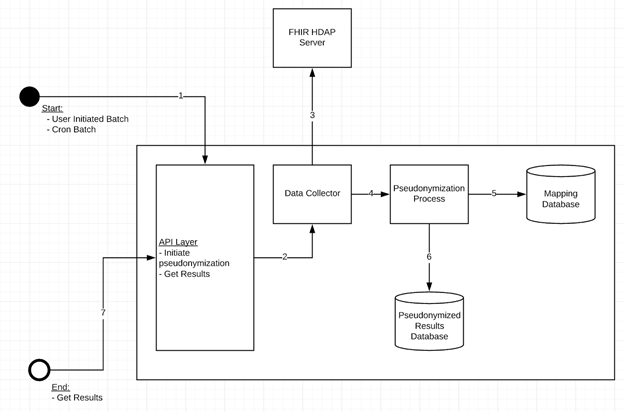
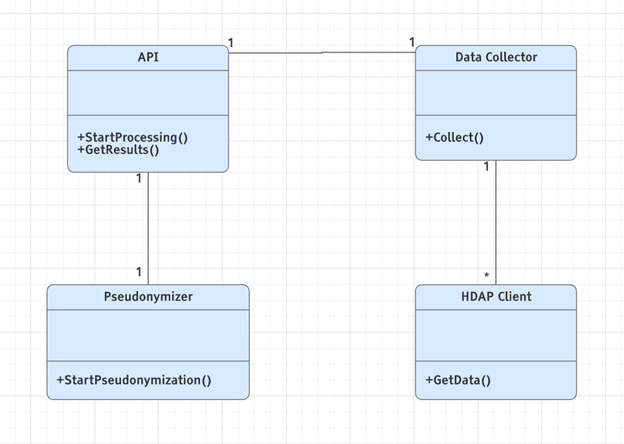
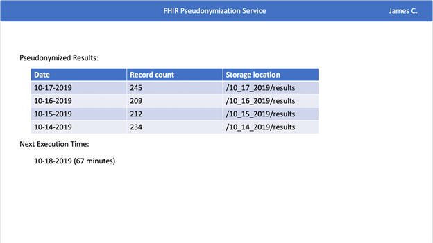
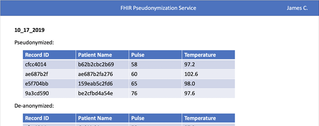

# Design Document

**Author**: James Calhoun, Alex Lipford, Katherine Lu, Robert Smayda

**Team**: Asclepius

## 1 Design Considerations

### 1.1 Assumptions

*Describe any assumption, background, or dependencies of the software, its use, the operational environment, or significant project issues. At this point you are only limited by the project description given and the HDAP environment.*
- FHIR Data Repository
- Mapping mechanism to de-anonymize data
  - In-memory or data store
- UI to interface with system and view results

### 1.2 Constraints

- Details remain high-level pending first meeting with project Mentor to flesh out more of the functional and non-function requirements

### 1.3 System Environment

- HDAP FHIR Server
- Docker environment
- Data store

## 2 Architectural Design

Overview of user interaction, internal components, and external HDAP FHIR System:

### 2.1 Component Diagram

This system's single component design approach is covered in Architectural Design section 2.

### 2.2 Deployment Diagram

This should not require deployment diagram. The system will be containerized using Docker and deployed through the provided pipeline system.

## 3 Class and Other Diagrams

Initial Class Diagram:

## 4 User Interface Design

Main Menu:

Results View:

