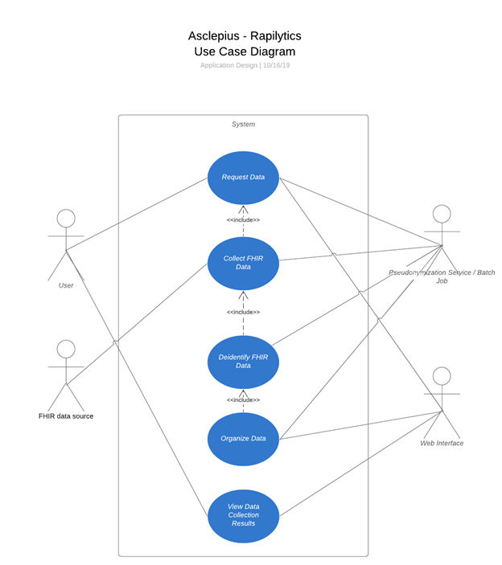
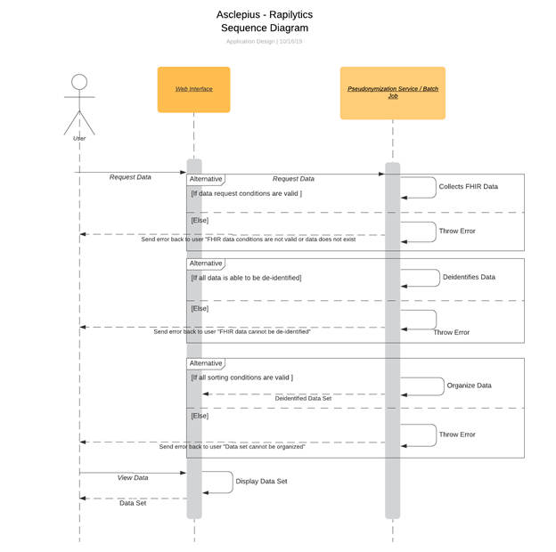

# Use Case Model

**Author**: James Calhoun, Alex Lipford, Katherine Lu, Robert Smayda

**Team**: Asclepius

## 1 Use Case Descriptions

I. User can request data on web interface
* **Requirements**: The user should be able to specify on a web interface form the conditions and constraints for the data they need collected.
* **Pre-conditions**: User is authenticated, data conditions and constraints are valid and exists.
* **Post-conditions**: Data must be accessible and exists with given conditions.

II. FHIR Database collects FHIR data
* **Requirements**: FHIR database will search for the data requested given the conditions provided.
* **Pre-conditions**: FHIR database is online, accessible and data exists.
* **Post-conditions**: Data must be accessible and exists with given conditions.

III. User can view data collection results on web interface
* **Requirements**: Data collected from the FHIR database and sent through the Pseudonymization​ ​service should be displayed on the web interface to the user in an exportable table format.
* **Pre-conditions**: connection to the Pseudonymization​ ​service is valid, data is returned back from that process.
* **Post-conditions**: data from the Pseudonymization service is visible to the user in the interface and can be exported by the user in the correct format.
​
IV. Pseudonymization Service collects FHIR data
* **Requirements**: Pseudonymization​ ​service collects the data set from the FHIR database for the de-identification process.
* **Pre-conditions**: connection to the FHIR database is online and valid, data in the FHIR database exists, data is being returned back to the Pseudonymization​ ​service.
* **Post-conditions**: data from the FHIR is accessible and is correctly sent to the Pseudonymization service in the correct format under the correct conditions.
​
V. ​Pseudonymization Service can de-identify FHIR data
* **Requirements**: Pseudonymization service will de-identify all patient data collected from the FHIR database.
* **Pre-conditions**: data set must exist, de-identification conditions must be correct and comply with HIPAA and other security conditions, de-identification process must be correctly implemented.
* **Post-conditions**: all data from the original data set has been de-identified complying with all HIPPA and other security conditions.
​
VI. ​Pseudonymization Service organizes data collected
* **Requirements**: De-identified data set is sorted and organized according to the sorting conditions given by the user or by the default sorting order when pulled from the FHIR database.
* **Pre-conditions**: data set must exist, sorting condition provided must exist
* **Post-conditions**: organized data set is sorted correctly and is in a format that is ready to be exported to the web interface.

VI. ​Web Interface displays data collected
* **Requirements**: web interface displays collected de-identified data set in a table format that is exportable for the user.
* **Pre-conditions**: connection to the Pseudonymization service is online and valid, data set exists to be passed to the interface.
* **Post-conditions**: correct data set displayed in a table format on the web
​
## 2 Use Case Model

## 3 Sequence Diagram

